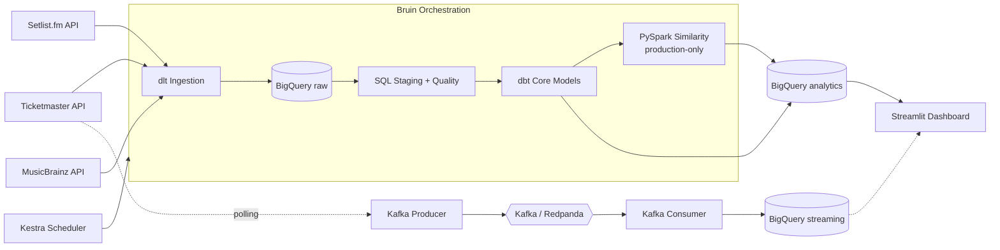

# GigWise Analytics: Concert Tour Analytics Engine

Data Engineering Zoomcamp 2026 capstone project by Lorenzo Ederone.

## 1. Problem Statement

Concert-goers, journalists, and music industry analysts do not have a unified way to answer core touring questions:

- Which artists tour most intensively across countries?
- What genres dominate the live touring landscape?
- How do setlists evolve over time — how many unique songs does each artist play per year?

This project builds an end-to-end data pipeline that ingests concert and setlist data from multiple APIs, stores raw data in BigQuery, transforms it with dbt, and exposes analytics through a Streamlit dashboard.

## 2. Zoomcamp Evaluation Mapping

| Criterion | How this project addresses it |
|---|---|
| Problem description | This README defines the analytical problem and business questions clearly |
| Cloud | GCP (GCS + BigQuery), provisioned with Terraform |
| Data ingestion | dlt API ingestion orchestrated by Bruin (DAG: ingestion → staging SQL → quality checks → dbt build), scheduled by Kestra |
| Data warehouse | BigQuery star schema with partitioning and clustering strategy |
| Transformations | dbt staging, intermediate, core, and marts layers |
| Dashboard | Streamlit dashboard with 2 core tiles + optional Spark/Kafka tiles |
| Reproducibility | Docker Compose, Makefile, env template, and step-by-step setup |
| Batch processing | PySpark artist similarity job (production-only, runs locally) |
| Streaming | Kafka (Redpanda) producer polls TM API for live event updates → consumer writes to BigQuery streaming dataset |

## 3. Why These Tools

The stack is intentionally aligned with course modules while using pragmatic additions.

- Terraform: IaC for reproducible GCP setup
- dlt: unified ingestion layer for Ticketmaster, Setlist.fm, and MusicBrainz
- Bruin: orchestration and SQL/quality execution layer
- Kestra: outer orchestration and scheduling
- BigQuery: analytical warehouse
- dbt Core: modeled transformations and tests
- Streamlit: easy, shareable dashboard implementation

If a tool was not deeply covered in the core lectures (for example Bruin), it is documented in this repository so reviewers can understand its role.

## 4. Data Sources

- Ticketmaster Discovery API: upcoming events across US, CA, GB, DE, IT markets (1 year forward window)
- Setlist.fm API: historical setlists with song-level detail (year 2000 onward)
- MusicBrainz API: canonical artist metadata, MBID join key, and genre tags (with persistent GCS-backed cache)

Important design rules:
- MBID is the canonical cross-source key. Artist-name joins are not reliable.
- Genre is sourced from MusicBrainz crowd-sourced tags.
- Ticket prices are out of scope (Ticketmaster GB market does not expose prices via API).

## 5. High-Level Architecture



## 6. Repository Structure

```text
gigwise-analytics/
├── README.md
├── .env.example
├── Makefile
├── docker-compose.yml
├── pyproject.toml
├── terraform/
│   ├── versions.tf
│   ├── variables.tf
│   ├── main.tf
│   └── outputs.tf
├── bruin/
│   ├── pipeline.yml
│   └── assets/
│       ├── ingestion/       (run_dlt_ingestion.py)
│       ├── staging/         (stg_concerts_union.sql)
│       ├── quality/         (check_event_dates.sql)
│       └── transformation/  (run_dbt_build.py, run_spark_enrichment.py)
├── dlt/
│   ├── ingest_pipeline.py
│   └── README.md
├── kestra/
│   └── flows/
│       └── concert_pipeline_daily.yml
├── spark_jobs/
│   ├── compute_artist_similarity.py
│   └── run_standalone.py
├── dbt/
│   ├── dbt_project.yml
│   ├── profiles.yml
│   ├── models/
│   │   ├── sources.yml
│   │   ├── staging/     (stg_ticketmaster__events, stg_setlistfm__setlists)
│   │   ├── intermediate/ (int_concerts_unified)
│   │   ├── core/        (dim_artist, fact_concert)
│   │   └── marts/       (mart_artist_touring_intensity, mart_artist_yearly_repertoire, mart_artist_setlist_freshness)
│   └── tests/
├── streamlit/
│   └── streamlit_app.py
└── docs/
    ├── index.md
    ├── project_context_and_objective.md
    ├── ingestion_design_and_rationale.md
    ├── dbt_models_and_logic.md
    ├── bruin_orchestration_and_quality.md
    └── critical_review_and_next_steps.md
```

## 7. Batch vs Stream Decision

Primary path: batch. Spark and Kafka are integrated as production add-ons.

- **Batch (primary):** dlt → BigQuery → dbt → Streamlit. PySpark computes artist repertoire similarity as an additional production-only enrichment step after dbt, writing results back to BigQuery.
- **Streaming (add-on):** Kafka producer polls Ticketmaster Discovery API for real-time event updates and publishes to Redpanda. Kafka consumer streams those events to BigQuery `streaming.live_event_updates` table. Fully toggleable via `make run-streaming` / `make stop-streaming`.

Reasoning for batch as primary path:
- Setlist and artist enrichment data changes on daily cadence, not second-by-second
- Batch improves cost control and reproducibility for peer review
- Spark and Kafka run as genuine pipeline components, not demos

## 8. Data Model Overview

Core entities implemented with dbt as dimensions/facts:

- `dim_artist`: unified artist dimension with genre from MusicBrainz tags
- `fact_concert`: central event fact table (UNION of Ticketmaster upcoming + Setlist.fm historical)

Marts for dashboard tiles:

- `mart_artist_touring_intensity`: touring intensity by artist, genre, and country (Tile 1)
- `mart_artist_yearly_repertoire`: unique songs played per artist per year (Tile 2)
- `mart_artist_setlist_freshness`: percentage of first-time songs per artist per year (Freshness Index)
- `spark_artist_similarity`: pairwise artist similarity by shared songs (Spark, production only)

## 9. Dashboard

The Streamlit app contains two core tiles, plus optional Spark and Kafka sections:

1. **Artist Touring Intensity**: Altair bar charts showing which artists have the most upcoming concerts across countries, with genre breakdown. Both charts sorted descending by concert count. Shows explicit date range of upcoming concerts.

2. **Setlist Repertoire Over Time**: per-artist bar chart of unique songs played each year, revealing how repertoire evolves over touring history.

3. **Setlist Freshness Index**: per-artist analysis showing what percentage of each year's setlist consists of songs appearing for the first time in the dataset. High freshness = fresh repertoire; low freshness = predictable setlist. First year is excluded (always 100%).

4. **Similar Artists (Shared Repertoire)** *(optional, production only)*: when `spark_artist_similarity` exists, shows a horizontal bar chart of the top 10 most similar artists to the selected artist, ranked by Jaccard similarity score based on shared concert songs.

5. **Live Event Stream** *(optional, when streaming is running)*: when `streaming.live_event_updates` exists, shows a full-width section with real-time event metrics, status breakdown chart, and recent event updates table.

## 10. Data Quality Controls

### Ingestion filtering

- **Ticketmaster**: events without an artist attraction are skipped; artists with fewer than 3 upcoming events are filtered out; attraction classification types "Event Style" and "Venue Based" are excluded (e.g., ABBA Voyage, Piano Bar Soho). Only genuine music artist types from MusicBrainz (Person, Group, Orchestra, Choir) are kept.
- **Setlist.fm**: uses MBID-based endpoint (`artist/{mbid}/setlists`) for exact artist matching when MBID is available. Falls back to name search with strict matching for unresolved artists. Up to 80 pages fetched per artist for full historical coverage. Only data from year 2000 onward is included (filtered in both the pipeline and the dbt staging model).

### dbt tests

- `dim_artist.artist_id`: not_null
- `fact_concert.concert_id`: not_null
- `fact_concert.event_date`: not_null
- Singular test: events not more than 3 years in future

## 11. Security and Secret Handling

Do not hardcode or commit secrets.

- Keep credentials in environment variables and local `.env`
- Service account JSON should never be committed
- `.env*` and key files are ignored by `.gitignore`
- Prefer least-privilege IAM roles
- Rotate keys immediately if exposed

## 12. Setup and Run (Step by Step)

### Step 1: Clone and initialize Python environment

```bash
uv sync
```

### Step 2: Configure environment variables

```bash
cp .env.example .env
source .env
```

Fill every required value in `.env` before running pipelines.

### Step 3: Provision cloud resources

```bash
make setup-infra
```

This creates:
- GCS bucket for the data lake
- BigQuery datasets (`raw`, `analytics`)
- pipeline service account (optional via Terraform variable)

### Step 4: Start local orchestration/services

```bash
docker compose up -d
```

### Step 5: Run ingestion and transformations

```bash
make run-bruin              # Full pipeline: dlt ingestion + SQL staging + quality checks + dbt build
```

### Step 6: Run dashboard

```bash
make run-dashboard
```

## 13. Quality Checks

Run:

```bash
make lint
make test
```

Included checks:
- Terraform formatting and validation
- dbt tests (schema + singular assertions)

## 14. Known Limitations

- **Ticketmaster GB market**: does not expose priceRanges via Discovery API. Prices removed from scope.
- **MusicBrainz genre coverage**: ~69% of artists have genre tags. Depends on community tagging.
- **Setlist.fm rate limits**: API returns 429 on rapid requests; pipeline retries with backoff.
- **Setlist.fm historical cutoff**: Only setlists from year 2000 onward are ingested (pipeline) and queried (dbt staging).
- **Ticketmaster auto-pagination**: In production mode, the pipeline uses monthly date chunks (12) and auto-paginates until the API returns no more results, ensuring complete event capture. Prototype mode uses a fixed 5-page cap for speed.
- **Pipeline mode toggle**: Set `PIPELINE_MODE=prototype` (default, <5 min) or `PIPELINE_MODE=production` (<1 hr) in `.env` or via any orchestrator env var (see `kestra/flows/concert_pipeline_daily.yml`).

## 15. Current Metrics

- raw.ticketmaster_events: upcoming events across US, CA, GB, DE, IT (quality-filtered, merge on event_id)
- raw.setlistfm_setlists: ~2455 setlists (3 tracked artists, MBID-based, up to 80 pages)
- raw.musicbrainz_artists: ~33 resolved artists
- analytics.dim_artist: ~72 rows with genre coverage
- analytics.fact_concert: ~2900 rows (UNION of Ticketmaster + Setlist.fm)
- analytics.mart_artist_yearly_repertoire: 63 rows (3 artists across multiple years)
- analytics.mart_artist_setlist_freshness: 15 rows
- dbt build: PASS=9 WARN=0 ERROR=0
