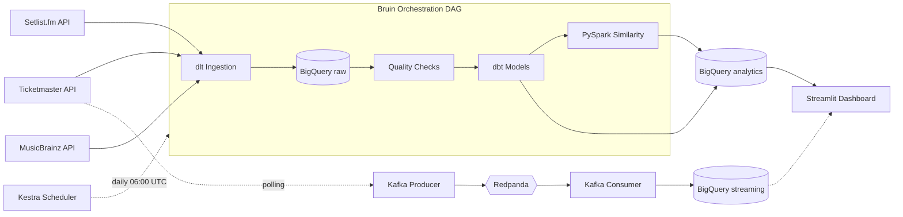
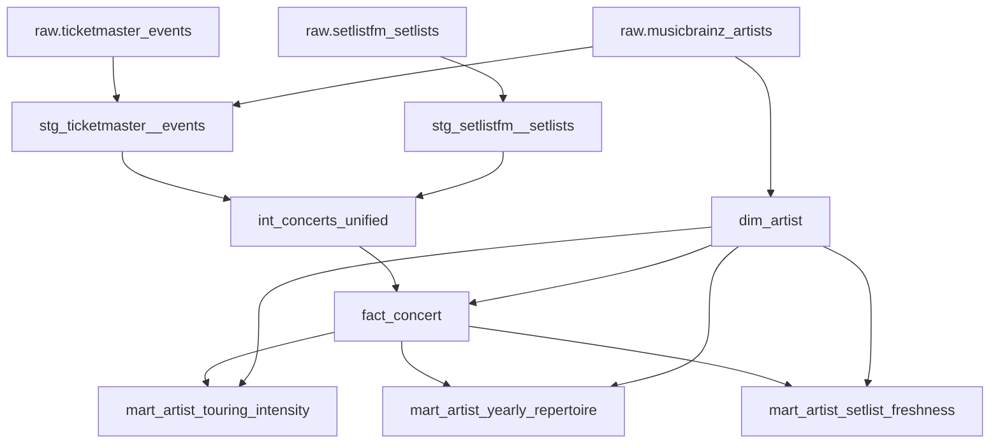

# GigWise Analytics

**Analytics on upcoming concerts and touring artists, powered by an open API pipeline.**

An end-to-end data pipeline that ingests concert and setlist data from multiple APIs, loads it into BigQuery, transforms it with dbt, and serves analytics through a Streamlit dashboard.

> **Dashboard link:** [gigwise.streamlit.app](https://gigwise.streamlit.app/) (runs on embedded snapshot)

*Data Engineering Zoomcamp 2026 capstone project by Lorenzo Ederone.*

---

## What It Answers

- **Which artists are currently touring most heavily** across the US, Canada, UK, Germany, and Italy?
- **What genres dominate** the live touring landscape?
- **How do setlists evolve** over years of touring — how many different songs does each artist play, and how fresh is their set?
- **Which artists play at the same venues** — who shares an audience?

---

## Architecture



**Data flow:** APIs → **dlt** (raw tables) → **Bruin** (orchestration) → **dbt** (staging → core → marts) → **Streamlit** (dashboard)

**Optional add-ons:** PySpark (batch artist similarity), Kafka/Redpanda (live event streaming)

---

## Tech Stack

| Layer | Tool | Role |
|---|---|---|
| Infrastructure | **Terraform** | Provisions GCS bucket, BigQuery datasets, service account |
| Ingestion | **dlt** | Loads Ticketmaster, Setlist.fm, MusicBrainz data into BigQuery with merge semantics |
| Orchestration | **Bruin** | Manages the pipeline DAG (ingestion → staging → quality → dbt → Spark) |
| Scheduling | **Kestra** | Daily cron trigger with web UI for monitoring |
| Warehouse | **BigQuery** | Serverless analytical warehouse |
| Transformation | **dbt Core** | SQL models: staging → intermediate → core → marts |
| Batch Processing | **PySpark** (Dataproc Serverless) | Artist similarity by shared venues |
| Streaming | **Kafka** (Redpanda) | Live event polling → BigQuery |
| Dashboard | **Streamlit** | Interactive analytics dashboard |
| Automation | **Makefile** | All commands via `make` targets — `make help` for the full list |

---

## Quick Start

```bash
# 1. Clone and install
git clone https://github.com/lorenzoeder/gigwise-analytics.git
cd gigwise-analytics
uv sync

# 2. Configure
cp .env.example .env     # Fill in your API keys and GCP project details

# 3. Provision infrastructure
make setup-infra          # Creates GCS bucket + BigQuery datasets via Terraform

# 4. Start services
docker compose up -d      # Kestra (port 8081), Kafka (9092), Kafka UI (8082)

# 5. Run the pipeline
make run-bruin            # Full pipeline: ingestion → staging → quality → dbt

# 6. Launch the dashboard
make run-dashboard        # Streamlit on port 8501
```

For detailed setup instructions (GCP auth, API keys, service accounts), see the **[User Guide](docs/user_guide.md)**.

---

## Dashboard

The dashboard has two main tiles:

1. **Touring Intensity** — Top artists by upcoming concert count, broken down by country and genre
2. **Setlist Evolution** — Unique songs per year with a Freshness Index overlay (high = fresh repertoire, low = predictable setlist)

Plus optional sections:
- **Similar Artists** — Jaccard similarity by shared venues (requires `make run-spark`)
- **Live Event Stream** — Real-time Ticketmaster updates (requires `make run-streaming`)

---

## Data Model



| Model | Purpose |
|---|---|
| `fact_concert` | Central event fact (UNION of Ticketmaster upcoming + Setlist.fm historical) |
| `dim_artist` | Unified artist dimension with MusicBrainz genre tags |
| `mart_artist_touring_intensity` | Concert count by artist, genre, country (upcoming only) |
| `mart_artist_yearly_repertoire` | Unique songs per artist per year |
| `mart_artist_setlist_freshness` | First-time song percentage per artist per year |
| `spark_artist_similarity` | Pairwise Jaccard similarity by shared venues |

---

## Project Structure

```text
gigwise-analytics/
├── Makefile                  # All pipeline commands (make help)
├── .env.example              # Environment variable template
├── docker-compose.yml        # Kestra, Kafka/Redpanda, Kafka UI
├── pyproject.toml            # Python dependencies
│
├── terraform/                # GCS bucket, BigQuery datasets, service account
├── dlt/                      # API ingestion pipeline (Ticketmaster, Setlist.fm, MusicBrainz)
├── bruin/                    # Orchestration DAG (ingestion → staging → quality → dbt → Spark)
├── dbt/                      # SQL transformations (staging → intermediate → core → marts)
├── kestra/                   # Daily scheduling flow (concert_pipeline_daily.yml)
├── spark_jobs/               # PySpark artist similarity (Dataproc Serverless)
├── kafka/                    # Streaming producer + consumer
├── streamlit/                # Dashboard app + Parquet export for cloud deployment
│
└── docs/                     # Documentation
    ├── user_guide.md         # Step-by-step setup and run guide
    ├── design_choices.md     # Detailed design rationale and limitations
    └── future_opportunities.md
```

---

## Make Targets

Run `make help` for the full list. Key targets:

| Target | What it does |
|---|---|
| `make run-bruin` | Full pipeline (ingestion → dbt) |
| `make run-dlt` | Ingestion only |
| `make run-dbt` | dbt build only |
| `make run-spark` | PySpark similarity job |
| `make run-streaming` | Start Kafka producer + consumer |
| `make stop-streaming` | Stop streaming |
| `make run-dashboard` | Start Streamlit dashboard |
| `make stop-dashboard` | Stop dashboard |
| `make export-dashboard-data` | Export dashboard data to Parquet |
| `make setup-infra` | Terraform apply |
| `make destroy-infra` | Terraform destroy |
| `make wipe-ingestion CONFIRM_WIPE=1` | Truncate raw tables |
| `make wipe-all CONFIRM_WIPE=1` | Wipe all data (raw, dbt, streaming, Spark, cache) |
| `make test` | Run dbt tests |
| `make lint` | Terraform format check |

---

## Cleanup

### Stop everything

```bash
make stop-dashboard
make stop-streaming
docker compose down
```

### Wipe data (pipeline can rebuild it)

```bash
make wipe-ingestion CONFIRM_WIPE=1   # Raw tables + staging view
make wipe-all CONFIRM_WIPE=1         # Everything: raw, dlt state, dbt models, streaming, Spark, MB cache
```

### Destroy cloud infrastructure

```bash
make destroy-infra                    # Removes GCS bucket, BigQuery datasets, service account
```

---

## Documentation

| Document | What it covers |
|---|---|
| **[User Guide](docs/user_guide.md)** | Full setup and run instructions |
| **[Design Choices](docs/design_choices.md)** | Detailed rationale for every component and its limitations |
| **[Future Opportunities](docs/future_opportunities.md)** | Ideas for extending the project |

---

## Known Limitations

- **Ticketmaster pricing**: `priceRanges` not exposed via Discovery API. Prices out of scope.
- **MusicBrainz genre coverage**: ~69% of artists have tags. Depends on community contributions.
- **Setlist.fm rate limits**: 429 responses handled with retry/backoff, but completeness not guaranteed under heavy throttling.
- **Historical cutoff**: Only setlists from year 2000 onward (older data too sparse).

See [Design Choices](docs/design_choices.md) for full details.
