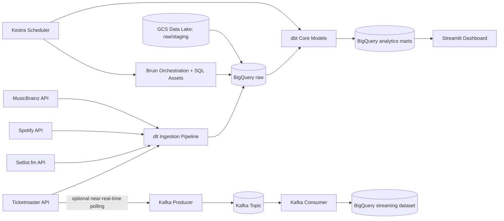

# GigWise Analytics: Concert Tour Analytics Engine

Data Engineering Zoomcamp 2026 capstone project by Lorenzo Ederone.

## 1. Problem Statement

Concert-goers, journalists, and music industry analysts do not have a unified way to answer core touring questions:

- Which artists tour most intensively across countries?
- How do setlists evolve over time?
- How does live touring activity relate to Spotify popularity?
- How do ticket prices vary by artist profile and geography?

This project builds an end-to-end data pipeline that ingests concert and setlist data from multiple APIs, stores raw data in a data lake, transforms it in BigQuery with dbt, and exposes analytics through a Streamlit dashboard.

## 2. Zoomcamp Evaluation Mapping

| Criterion | How this project addresses it |
|---|---|
| Problem description | This README defines the analytical problem and business questions clearly |
| Cloud | GCP (GCS + BigQuery), provisioned with Terraform |
| Data ingestion | Unified dlt ingestion orchestrated with Bruin and Kestra |
| Data warehouse | BigQuery star schema with partitioning and clustering strategy |
| Transformations | dbt staging, core, and marts |
| Dashboard | Streamlit dashboard with at least 2 meaningful tiles |
| Reproducibility | Docker Compose, Makefile, env template, and step-by-step setup |

## 3. Why These Tools

The stack is intentionally aligned with course modules while using pragmatic additions.

- Terraform: IaC for reproducible GCP setup
- dlt: unified ingestion layer for Ticketmaster, Setlist.fm, MusicBrainz, and Spotify
- Bruin: orchestration and SQL/quality execution layer
- Kestra: outer orchestration and scheduling
- BigQuery: analytical warehouse
- dbt Core: modeled transformations and tests
- Streamlit: easy, shareable dashboard implementation
- Spark (optional batch enhancement): multi-source joins at parquet stage
- Kafka (optional streaming enhancement): ticket status updates

If a tool was not deeply covered in the core lectures (for example Bruin), it is documented in this repository so reviewers can understand its role.

## 4. Data Sources

- Ticketmaster Discovery API: events, venues, ticketing status, price ranges
- Setlist.fm API: historical setlists, songs, encores
- Spotify Web API: popularity snapshots, followers, genres
- MusicBrainz API: canonical artist metadata and MBID join key
- OpenMeteo (optional): weather enrichment for event context

Important design rule: MBID is the canonical cross-source key. Artist-name joins are not reliable.

## 5. High-Level Architecture



## 6. Repository Structure

```text
gigwise-analytics/
├── README.md
├── .env.example
├── Makefile
├── docker-compose.yml
├── terraform/
│   ├── versions.tf
│   ├── variables.tf
│   ├── main.tf
│   └── outputs.tf
├── bruin_pipeline/
│   ├── pipeline.yml
│   └── assets/
│       ├── ingestion/
│       ├── staging/
│       └── quality/
├── dlt_pipeline/
│   ├── ingest_pipeline.py
│   └── README.md
├── kestra/
│   └── flows/
├── spark_jobs/
├── dbt_concert/
│   ├── dbt_project.yml
│   ├── profiles.yml.example
│   ├── models/
│   └── tests/
├── dashboard/
│   └── streamlit_app.py
├── kafka/
│   ├── producer.py
│   └── consumer.py
└── docs/
	└── first_time_setup_checklist.md
```

## 7. Batch vs Stream Decision

Primary path: batch.

Reasoning:
- Setlist and artist enrichment data changes on daily cadence, not second-by-second
- Batch improves cost control and reproducibility for peer review
- Zoomcamp criteria accept either batch or streaming

Streaming is included as an optional enhancement for ticket availability updates.

## 8. Data Model Overview

Core entities are implemented with dbt as dimensions/facts (initial subset included in this repository):

- `dim_artist`
- `fact_concert`
- `fact_artist_snapshot`

Starter marts for dashboard tiles:

- `mart_genre_country_distribution`
- `mart_artist_monthly_activity`

Partitioning/clustering strategy for full build:

- `fact_concert`: partition by `event_date`, cluster by `artist_id, country`
- `fact_setlist_song`: partition by `event_date`, cluster by `artist_id, song_id`
- `fact_artist_snapshot`: partition by `snapshot_date`, cluster by `artist_id`

## 9. Dashboard Requirements Coverage

The Streamlit app contains two core tiles required by the project rubric:

1. Categorical distribution tile:
   genre-country concert counts
2. Temporal tile:
   monthly artist touring activity with popularity trend overlay

## 10. Security and Secret Handling

Do not hardcode or commit secrets.

- Keep credentials in environment variables and local `.env`
- Service account JSON should never be committed
- `.env*` and key files are ignored by `.gitignore`
- Prefer least-privilege IAM roles
- Rotate keys immediately if exposed

## 11. Setup and Run (Step by Step)

### Step 1: Clone and initialize Python environment

```bash
uv sync
```

### Step 2: Configure environment variables

```bash
cp .env.example .env
source .env
```

Fill every required value in `.env` before running pipelines.

### Step 3: Provision cloud resources

```bash
make setup-infra
```

This creates:
- GCS bucket for the data lake
- BigQuery datasets (`raw`, `staging`, `analytics`, `streaming`)
- pipeline service account (optional via Terraform variable)

### Step 4: Start local orchestration/services

```bash
docker compose up -d
```

Local service ports:
- Kestra: `8081`
- Spark UI: `8080`
- Kafka broker: `9092`
- Kafka UI: `8082`

### Step 5: Run ingestion and transformations

```bash
make run-dlt-snapshots-dry
make run-dlt-snapshots
make run-bruin
make run-dbt
```

`run-dlt-snapshots-dry` validates extraction without loading. `run-dlt-snapshots` loads all API ingestion tables to BigQuery raw. `run-bruin` then executes orchestration/validation assets.

### Step 6: Run dashboard

```bash
make run-dashboard
```

### Step 7 (optional): Run Spark join job

```bash
make run-spark
```

### Step 8 (optional): Start Kafka enhancement

```bash
make run-kafka
```

## 12. Quality Checks

Run:

```bash
make lint
make test
```

Included checks:
- Terraform formatting and validation
- dbt tests
- dbt singular assertions in `dbt_concert/tests`

## 13. Cost Controls

- Set BigQuery daily quota caps
- Create billing alerts ($1 and $5)
- Keep bucket lifecycle and retention policy under control
- Start with a narrow artist list during development

## 14. Current Status and Next Build Chunks

Implemented in this first build chunk:
- project scaffolding and reproducible structure
- Terraform base resources
- Bruin and Kestra starter configs
- dbt starter models and tests
- Streamlit dashboard skeleton with 2 required tiles

Next recommended chunk:
- implement real ingestion logic for each API and schema-normalized raw tables
- wire dbt profiles and full star schema
- complete end-to-end dry run on a small artist subset
