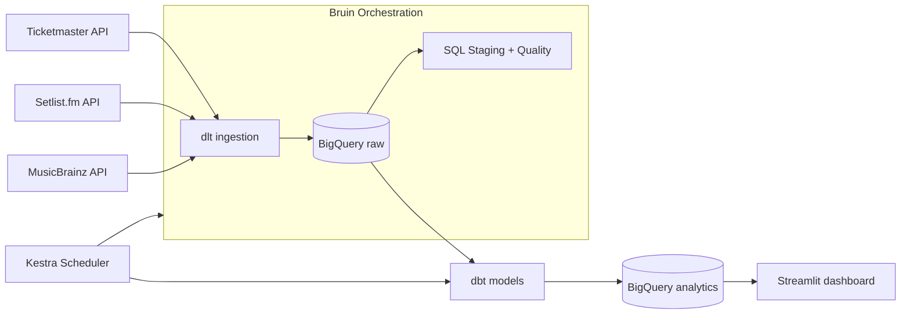
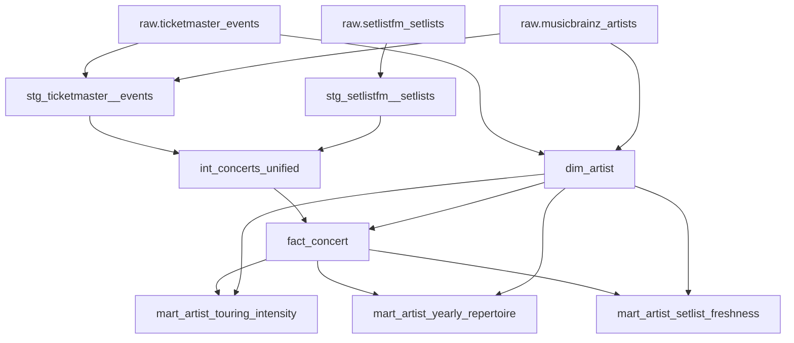

# GigWise Analytics — Documentation

## Project documentation

| Document | Contents |
|---|---|
| [User Guide](./user_guide.md) | Step-by-step setup and run instructions |
| [Design Choices](./design_choices.md) | Component-by-component rationale and known limitations |
| [Project Context](./project_context_and_objective.md) | Problem statement, architectural intent, success criteria |
| [Future Opportunities](./future_opportunities.md) | Ideas for extending the project |

## Component READMEs

Each pipeline component has its own README with implementation details:

| Component | Location |
|---|---|
| Ingestion (dlt) | [`dlt/README.md`](../dlt/README.md) |
| Orchestration (Bruin) | [`bruin/README.md`](../bruin/README.md) |
| Transformation (dbt) | [`dbt/README.md`](../dbt/README.md) |

## Architecture

## dbt model lineage

